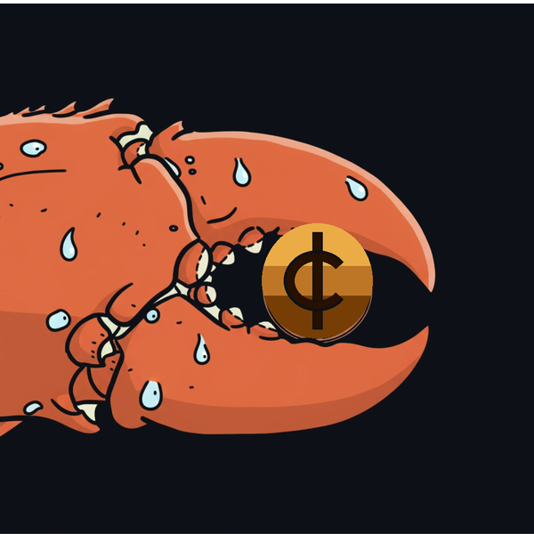
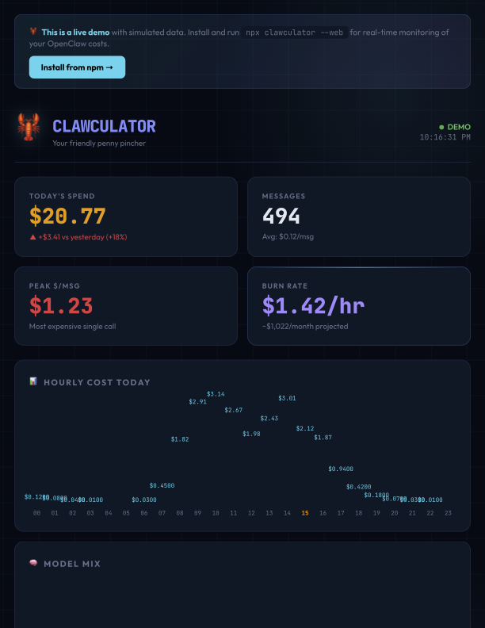

<p align="center">
  
</p>

# Clawculator 🦞

> **Your friendly penny pincher.**

AI cost forensics for OpenClaw and multi-model setups. Real-time browser dashboard. Terminal monitoring. Full offline analysis. Zero AI. Pure deterministic logic.

[](https://badge.fury.io/js/clawculator)
[](https://opensource.org/licenses/MIT)
[](https://echoudhry.github.io/clawculator)

---

## The problem

You set up OpenClaw. It runs great. Then your API bill arrives and you have no idea why it's $150. Was it the heartbeat? A skill running a polling loop? WhatsApp groups processing every message on Sonnet? Orphaned sessions? Hooks on the wrong model?

It could be any of these. Clawculator finds all of them — with zero AI, zero guesswork, and zero data leaving your machine.

---

## Quick start

```bash
npx clawculator --web     # Browser dashboard at localhost:3457
```

That's it. Pin the tab. Watch your costs in real-time while you work.

---

## [▶ Live Demo](https://echoudhry.github.io/clawculator)

See the full dashboard with simulated data — Pac-Claw, hourly charts, heat map, live feed, and more.



---

## 🦞 The Pac-Claw

The dashboard features a Pac-Man-style lobster claw that chomps across the header eating pennies. When an API call comes in, the claw goes into **TURBO mode** — speeds up 3x, glows red, and extra pennies spawn. Because your friendly penny pincher should look the part.

---

## Modes

### `--web` — Browser Dashboard (new in v2.6)

```bash
npx clawculator --web
```

A live-updating browser dashboard at `localhost:3457` powered by SSE (Server-Sent Events) — no polling, instant updates when API calls land.

**What you see:**
- 🔥 **Today's Spend** — big number, real-time, color-coded (green → amber → red)
- 📊 **Hourly Cost Chart** — bar chart with current hour highlighted
- 🧠 **Model Mix Donut** — spend breakdown by model (Sonnet vs Opus vs Haiku)
- ⚡ **Active Sessions** — table sorted by cost with model + message count
- 🏆 **Costliest Calls** — leaderboard with gold/silver/bronze ranks
- 📅 **Daily History** — 14-day bar chart with yesterday comparison
- 🔥 **Spend Heat Map** — 30-day grid (like GitHub contributions, but for spend)
- 🌊 **Live Feed** — every API call as it happens with slide-in animations
- 💰 **Burn Rate** — projected monthly cost based on today's velocity

**Persistence:** Data is stored in SQLite at `~/.openclaw/clawculator.db`. History builds over time — the longer you run it, the richer your charts get.

```bash
npx clawculator --web --port=8080    # Custom port
```

### `--live` — Terminal Dashboard

```bash
npx clawculator --live
```

A real-time terminal dashboard that watches `.jsonl` transcripts. Perfect for a tmux pane alongside your main session:

```bash
tmux split-window -h "npx clawculator --live"
```

Press `q` to quit, `r` to force refresh.

### `--report` — HTML Report

```bash
npx clawculator --report
```

Generates a full HTML report and opens it in your browser. Includes findings with terminal-style fix commands, session tables, cost summary, and quick wins.

### `--md` — Markdown Report

```bash
npx clawculator --md
```

Structured report your OpenClaw agent can read directly. Drop it in your workspace and ask your agent "what's my cost status?"

### Default — Terminal Analysis

```bash
npx clawculator
```

Color-coded findings by severity with cost estimates and exact fix commands. Today's spend, all-time spend, session breakdown, and actionable quick wins.

---

## 🔒 100% offline. Zero AI.

Clawculator uses **pure switch/case deterministic logic** — no LLM, no Ollama, no model of any kind. Every finding and recommendation is hardcoded. Results are 100% reproducible and non-negotiable.

Your `openclaw.json`, session logs, and API keys never leave your machine. The `--web` dashboard runs on `localhost` only. There is no external server. Disconnect your internet and run it — it works.

---

## What it finds

| Source | What it catches | Severity |
|--------|----------------|----------|
| 💓 Heartbeat | Running on paid model instead of Ollama | 🔴 Critical |
| 💓 Heartbeat | target not set to "none" (v2026.2.24+) | 🟠 High |
| 🔧 Skills | Polling/cron loops on paid model | 🔴 Critical |
| 📱 WhatsApp | Groups auto-joined on primary model | 🔴 Critical |
| 🪝 Hooks | boot-md, command-logger, session-memory on Sonnet | 🟠 High |
| 💬 Sessions | Orphaned sessions still holding tokens | 🟠 High |
| 🤖 Subagents | maxConcurrent too high — burst multiplier | 🟠 High |
| 📁 Workspace | Too many root .md files inflating context | 🟡 Medium |
| 🧠 Memory | memoryFlush on primary model | 🟡 Medium |
| 💸 Transcript gaps | sessions.json vs actual .jsonl cost discrepancy | 🔴 Critical |
| ⚙️ Primary model | Cost awareness of chosen model tier | ℹ️ Info |

---

## Transcript parsing

Clawculator reads `.jsonl` transcript files directly from `~/.openclaw/agents/*/sessions/` to calculate **actual API spend** — not what `sessions.json` reports (which can be 1000x+ under-reported).

The `--web` and `--live` modes watch these files in real-time, tailing new lines as they're appended. Every API call shows up in your dashboard the moment it happens.

---

## All flags

```bash
npx clawculator                          # Terminal analysis (default)
npx clawculator --web                    # Browser dashboard (localhost:3457)
npx clawculator --web --port=8080        # Custom port
npx clawculator --live                   # Real-time terminal dashboard
npx clawculator --report                 # Visual HTML report
npx clawculator --md                     # Markdown report
npx clawculator --json                   # JSON for piping
npx clawculator --md --out=~/cost.md     # Custom output path
npx clawculator --config=/path/to/openclaw.json
npx clawculator --help
```

---

## Use as an OpenClaw skill (ClawHub)

Install clawculator as a skill so you can type `clawculator` in your OpenClaw webchat and get a full cost report inline.

**Install via ClawHub:**
```bash
npm i -g clawhub
clawhub install clawculator
```

Then start a new OpenClaw session and type:
```
clawculator
```

Your agent runs the analysis and returns the full markdown report directly in chat.

**Or install manually** into your workspace:
```bash
mkdir -p ~/clawd/skills/clawculator
curl -o ~/clawd/skills/clawculator/SKILL.md \
  https://raw.githubusercontent.com/echoudhry/clawculator/main/skills/clawculator/SKILL.md
```

---

## Tech stack

- **Node.js** — zero dependencies for core analysis
- **better-sqlite3** — optional, powers `--web` persistence and historical charts
- **SSE** — Server-Sent Events for real-time browser updates (no WebSocket overhead)
- **fs.watch** — native file watching for `.jsonl` transcript tailing
- Pure CSS animations — no React, no build step, no bundler

---

## Built by

[Ed Choudhry](https://github.com/echoudhry) — after personally losing hundreds of dollars to silent API cost bleed. Every cost source in this tool was discovered the hard way.

If this saved you money, star the repo and share it in the OpenClaw Discord.

---

## License

MIT — free forever, open source, no telemetry, no accounts.
